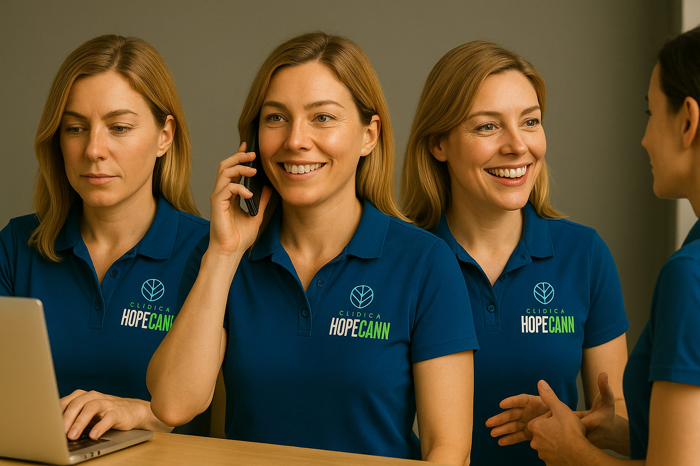
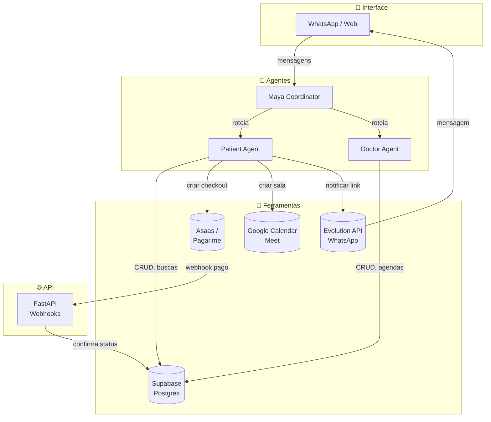
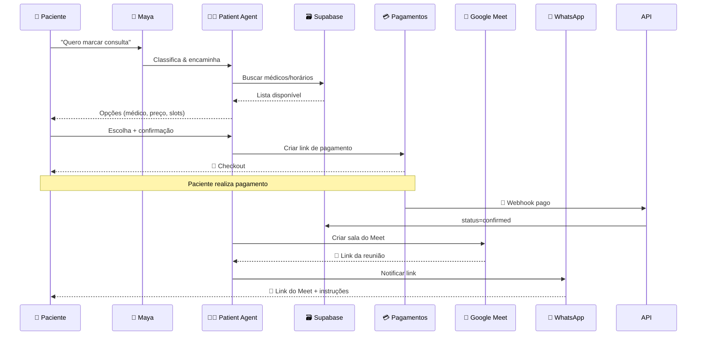
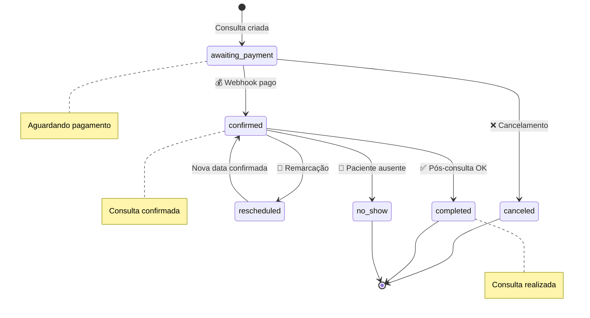
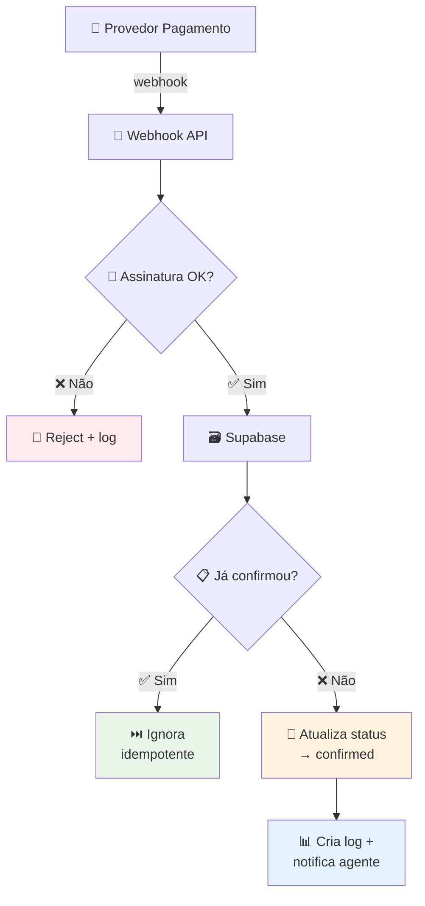

# Maya (Agno) — Telemedicina Autônoma



> **Coordenadora + Paciente + Médico** no framework **Agno**, com **FastAPI**, **Supabase (Postgres)**, **Google Calendar/Meet**, **Pagamentos (Asaas/Pagar.me)** e **WhatsApp (Evolution API)**. Projeto modular, observável e idempotente.

---

## ⚡ TL;DR

* **3 camadas**: Agentes (Agno) · API (FastAPI) · Infra/Integrações (Supabase/Meet/Pagamentos/WhatsApp)
* **Fluxo canônico**: rascunho (awaiting\_payment) → checkout → webhook pago → confirmar consulta → gerar Meet → notificar
* **Pronto pra produção**: logs, reconciliação de webhooks, masking de CPF, prompts curtos e objetivos

---

## 🧭 Arquitetura



### Time de agentes

* **Maya (Coordinator)**: classifica intenção, orquestra agentes especialistas e valida critérios de sucesso.
* **Patient Agent**: agenda/remarca/cancela, integra pagamento e Meet, faz follow-up.
* **Doctor Agent**: onboarding, agenda/slots, documentos (laudo/receita/atestado) e visão financeira.

---

## 🗂 Estrutura de Pastas

```
maya/
  api/
    main.py
    routes/
      health.py
      appointments.py
      payments.py
      webhooks.py
  agents/
    maya_coordinator.py
    patient_agent.py
    doctor_agent.py
  tools/
    supabase_tools.py
    calendar_tools.py
    payments/
      asaas.py
      pagarme.py
    messaging/
      evolution_whatsapp.py
    docs_tools.py
  services/
    supabase_client.py
  prompts/
    system_maya.md
    style_guide.md
    patient.md
    doctor.md
  data/
    maya_qa_300.json
  db/
    supabase_schema.sql
  .env.example
  pyproject.toml
  README.md
```

---

## 🔐 Variáveis de Ambiente

| Chave                         | Exemplo                       | Descrição                            |
| ----------------------------- | ----------------------------- | ------------------------------------ |
| `OPENAI_API_KEY`              | `sk-...`                      | Modelo OpenAI (Agno)                 |
| `SUPABASE_URL`                | `https://xxx.supabase.co`     | URL do projeto Supabase              |
| `SUPABASE_KEY`                | `service_role/anon`           | Chave do Supabase                    |
| `GOOGLE_SERVICE_ACCOUNT_JSON` | `/run/secrets/google_sa.json` | Credencial da Service Account        |
| `GOOGLE_CALENDAR_ID`          | `primary`                     | Agenda usada para Meet               |
| `PAYMENT_PROVIDER`            | `asaas`                       | `asaas` ou `pagarme`                 |
| `ASAAS_API_KEY`               | `...`                         | API Key Asaas                        |
| `ASAAS_WEBHOOK_SECRET`        | `...`                         | (Opcional) assinatura de webhook     |
| `PAGARME_API_KEY`             | `...`                         | API Key Pagar.me (Base64 para Basic) |
| `PAGARME_WEBHOOK_SECRET`      | `...`                         | Assinatura de webhook                |
| `EVOLUTION_URL`               | `http://localhost:8080`       | Host da Evolution API                |
| `EVOLUTION_TOKEN`             | `...`                         | Token da instância Evolution         |
| `AGNO_TELEMETRY`              | `false`                       | Telemetria dos agentes               |

> **Dica**: mantenha o JSON da Service Account **fora do repo** e injete via secret.

---

## 🚀 Quickstart

```bash
uv venv && source .venv/bin/activate
uv pip install -e .
cp .env.example .env  # preencha as chaves
uvicorn api.main:app --reload --port 8002
```

* Abra `http://localhost:8002/docs` para testar as rotas.
* Use o endpoint do Agno (`/chat/maya`) para conversar com a Maya.

---

## 🧪 Testes rápidos (curl)

### Health

```bash
curl -s http://localhost:8002/healthz
```

### Criar rascunho de consulta

```bash
curl -s -X POST http://localhost:8002/appointments \
  -H 'Content-Type: application/json' \
  -d '{
    "patient_id":"UUID-PACIENTE",
    "doctor_id":"UUID-MEDICO",
    "starts_at":"2025-08-10T14:00:00-03:00",
    "price_cents":20000
  }'
```

### Checkout de pagamento

```bash
curl -s -X POST http://localhost:8002/payments/link \
  -H 'Content-Type: application/json' \
  -d '{"value":200.0, "description":"Consulta Hopecann", "customer_id":"CUS-123"}'
```

### Webhook (simulação)

```bash
curl -s -X POST http://localhost:8002/webhooks/asaas \
  -H 'Content-Type: application/json' \
  -d '{
    "event":"PAYMENT_CONFIRMED",
    "payment":{"externalReference":"UUID-APPOINTMENT"}
  }'
```

---

## 🧩 API (Resumo)

| Método | Caminho             | Uso                                     |
| ------ | ------------------- | --------------------------------------- |
| `GET`  | `/healthz`          | Liveness/Readiness                      |
| `POST` | `/appointments`     | Cria rascunho `awaiting_payment`        |
| `POST` | `/payments/link`    | Gera link de pagamento (Asaas/Pagar.me) |
| `POST` | `/webhooks/asaas`   | Trata eventos de pagamento Asaas        |
| `POST` | `/webhooks/pagarme` | Trata eventos Pagar.me                  |
| `POST` | `/chat/maya`        | Rota Agno para conversar com a Maya     |

> As rotas Agno adicionais são expostas automaticamente via `add_routes(app, agents=[...], teams=[...])`.

---

## 🔄 Fluxos Críticos

### Agendamento (sequência)



### Máquina de estados — `appointments.status`



### Reconciliação de Webhook



---

## 🧠 Agno — Agentes & Prompts

* **Maya (Coordinator)**

  * **Papel**: orquestrar, aplicar critérios de sucesso, minimizar chamadas de ferramenta.
  * **Regras**: confirmar antes de ações irreversíveis; nunca encerrar sem “próximo passo”.
* **Patient Agent**

  * **Papel**: agendar/remarcar/cancelar; gerar checkout; criar Meet; notificar.
  * **Ferramentas**: `PatientDBTools`, provedor de pagamento, `CalendarTools`, `WhatsAppTools`, `DocsTools`.
* **Doctor Agent**

  * **Papel**: onboarding, agenda/slots, documentos e financeiro.
  * **Ferramentas**: `DoctorDBTools`, `CalendarTools`, `DocsTools`.

**Guia de Estilo (prompts)**

* Tom direto e humano, sem redundância.
* Sempre responder com: **Status | Opções | Próximo passo | Prazo**.
* Avisar em **1 linha** antes de usar cada ferramenta (o que e por quê).
* LGPD: mascarar CPF; nunca vazar dado sensível em claro.

---

## 🗃 Banco de Dados (Supabase)

Tabelas mínimas (ver `db/supabase_schema.sql`):

* `patients`, `doctors`, `appointments`, `payments`, `documents`, `interaction_logs`

**Chaves de negócio**

* `appointments.status`: `awaiting_payment | confirmed | rescheduled | canceled | completed | no_show`
* `payments.status`: `created | pending | paid | failed | refunded`

---

## 🔒 Segurança & LGPD

* **Masking** de CPF e dados sensíveis em logs e mensagens.
* **Idempotência** em webhooks (use `external_id`/`trace_id`).
* **Assinatura** de webhooks (provider) + verificação de origem.
* **Menor privilégio** para chaves (use `service_role` apenas no backend confiável).
* **Consentimento** registrado na primeira interação.

---

## 📈 Observabilidade & Resiliência

* **`interaction_logs`**: tudo com `trace_id` para auditoria.
* **Retries exponenciais** para integrações externas.
* **Circuit breaker** simples por ferramenta (desliga após N falhas/min).
* **Métricas úteis**: latência por tool, taxa de sucesso por fluxo, % no-show, tempo de compensação PIX.

---

## 🧰 Troubleshooting

* **Webhook pago, status não mudou** → conferir assinatura, idempotência e se `externalReference` bate com `appointments.id`.
* **Meet não gerou link** → checar `GOOGLE_SERVICE_ACCOUNT_JSON`, permissões do Calendar e `conferenceDataVersion=1`.
* **WhatsApp não envia** → validar `EVOLUTION_URL/TOKEN` e formatação do número (DDI+DDD+Número).
* **Erro de CORS na Web** → habilitar CORS no FastAPI conforme seu domínio.

---

## 📦 Deploy (exemplo Docker opcional)

```dockerfile
# Dockerfile (exemplo)
FROM python:3.12-slim
WORKDIR /app
COPY pyproject.toml .
RUN pip install --upgrade pip && pip install uv
COPY . .
EXPOSE 8002
CMD ["uv", "run", "uvicorn", "api.main:app", "--host", "0.0.0.0", "--port", "8002"]
```

```bash
docker build -t maya-agno .
docker run --env-file .env -p 8002:8002 maya-agno
```

---

## 🗺 Roadmap breve

* WABA oficial (Meta) com templates e opt-in.
* Emissão de NF automática e painel financeiro do médico.
* Vetorização de `data/maya_qa_300.json` para RAG com pgvector.
* Painel de observabilidade (Grafana/Prometheus) e tracing distribuído.

---

## ✍️ Licença

MIT — use, quebre e reconstrua.

---

## 🙌 Créditos

* Stack consolidada por boas práticas do ecossistema **Agno + FastAPI**.
* Obrigado, Yohann, por exigir sempre o **estado da arte**.
